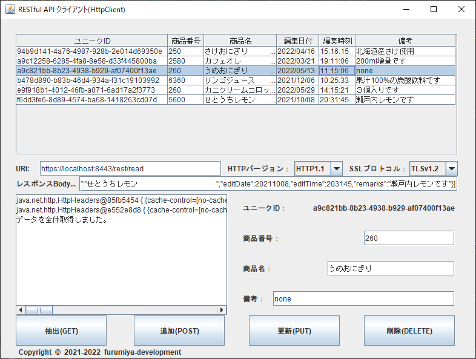
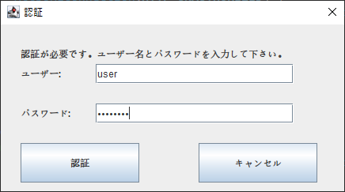

## :computer: JSON形式でHTTPS通信するRESTクライアント(Swing)  
___

### 開発環境  

```
統合開発環境：Eclipse 2022-09 R(4.25.0) Pleiades  
言語：Java 17  
開発SDK：Oracle JDK 17.0.5  
デスクトップ：Swing
JSONライブラリー：Jackson 2.14.1  
```

#### 画面イメージ  
  

#### 認証イメージ  
  

___